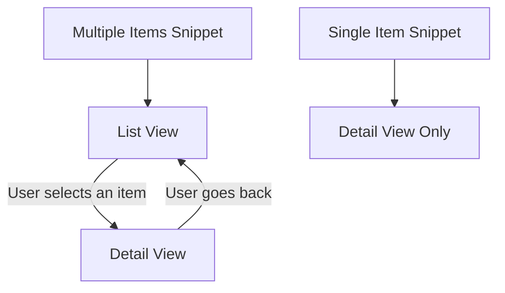

## What is a Snippet?

At its core, a **Snippet** is an AI-generated, visually interactive mini-application that represents a specific view of your Airtable data. Think of it as creating a custom-built, live webpage or small app directly from one of your Airtable tables.

## The Power of Snippets

Unlike sharing a raw Airtable view or exporting data, a **Snippet** provides a curated, branded experience for the end-user. It's designed to be simple for them to consume and interact with, focusing only on the information you choose to share.

- **Live Syncing:** Snippets stay live-synced with your Airtable base. Changes in Airtable automatically reflect in the Snippet.
- **Two-way Updates:** If you enable interactive elements, changes made via the Snippet can write back to Airtable in real-time.
- **Device Friendly:** Optimized for viewing on any device - mobile, tablet, or desktop.
- **Secure Access:** Control exactly what data is visible and who can see or edit it.

## Snippet Types

When you create a new snippet, [you must choose its fundamental type](/chapters/building-and-understanding-snippets/understanding-snippet-types), which dictates how the data from your selected Airtable table will be presented:

| Type               | Focus         | Views                  | Ideal Use Cases                                                                                     |
| :----------------- | :------------ | :--------------------- | :-------------------------------------------------------------------------------------------------- |
| **Single Item**    | One record    | Detail View            | Customer profiles, Project details, Product specs, Event info, Property listings                    |
| **Multiple Items** | Filtered list | List View, Detail View | Task lists, Property portfolios, Client‑specific matters, Inventory collections, Project dashboards |

