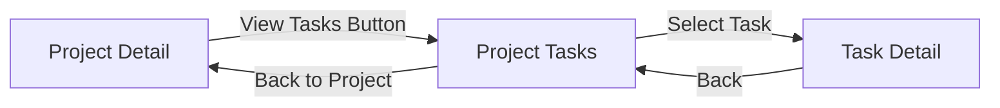

<Tip icon="link">
  **Building Connected Experiences**  
  While individual snippets provide powerful, focused views of your Airtable data, the true potential of Crust AI emerges when you connect multiple snippets together, creating seamless navigation flows between different data views.
</Tip>

## The Power of Connected Snippets

Single, standalone snippets are excellent for sharing specific pieces of information, but many real-world data applications require users to navigate between related datasets. By linking snippets together, you can build comprehensive, multi-view applications that feel like custom-built software without any traditional coding.

<Accordion title="Example: Client Portal Application">
  Instead of creating one massive, complex snippet that tries to show everything, you might create several interconnected snippets:

  1.  A **Projects Dashboard** snippet (Multiple Items - List View) showing all active projects for a specific client
  2.  A **Project Detail** snippet (Multiple Items - Detail View) showing comprehensive details about one project
  3.  A **Tasks** snippet (Multiple Items - List View) showing tasks related to a specific project
  4.  A **Team Members** snippet (Multiple Items - List View) showing people assigned to a project

  Each snippet is focused on one clear purpose, but together they form a cohesive application with intuitive navigation between views.
</Accordion>

---

## Benefits of Linking Snippets

*   **Improved User Experience:** Navigation between related data views creates a more intuitive and app-like experience. Users can drill down from lists to details and navigate between related records following natural data relationships.
*   **Maintainability:** Each snippet can be modified independently, making it easier to update specific parts of your application without disrupting the entire experience.
*   **Secure, Granular Access Control:** Different snippets can have different permission settings, enabling advanced granular control over who can see or interact with specific data views, even within the same overall application.
*   **Reusability:** The same snippet can be linked from multiple places, avoiding duplication of effort.

---

## Common Linking Patterns

### 1. List-Detail Flow

The most common pattern is a "list-detail" relationship, where:

*   A Multiple Items snippet shows a list view, displaying multiple records (the "list" view)
*   Clicking a record navigates to a detail view showing that record's details (the "detail" view)

This flow is automatically enabled when using a 'Multiple Items' snippet type.

[Illustration of a list-detail flow with arrows showing navigation from list to detail view]

### 2. Record-to-Related-Records Flow

Another powerful pattern links a record to a filtered view of related records:

*   A Single Item snippet shows a record's details (e.g., a Project)
*   A button navigates to a Multiple Items snippet showing only records related to the original (e.g., Tasks for that Project)

### 3. Hub-and-Spoke Navigation

Creating a central "hub" snippet that links to various related "spoke" snippets:

*   A 'Home Page' snippet serves as the hub (usually, a single item snippet type)
*   Multiple buttons navigate to different specialized views
*   Each spoke has a way to return to the hub

---

<Tip icon="lightbulb">
  **Strategic Snippet Design**  
  When building multi-snippet applications, think about the user's journey through your data. Map out the navigation flows before building to ensure a coherent experience.
</Tip>

---

## Next Steps

In the following pages, we'll explore:

*   [How to Add Navigation Between Snippets](/chapters/navigating-between-snippets-for-building-robust-apps/how-to-add-navigation-to-snippets)